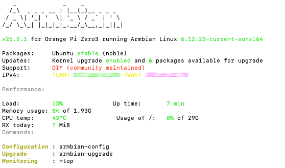

# orangepi-home-gateway

Modular home network gateway built on Armbian and Orange Pi, delivering DNS filtering, firewall management, and scalable edge services.

## Overview

This project transforms an **Orange Pi Zero 3** into a reliable, always-on **Home Network Gateway** that provides:

- **DNS Filtering** (using AdGuard Home)  
- **Network Security Services**  
- **Infrastructure services expandable in future phases**  

This guide documents the *first phase* of the build — setup of the OS and AdGuard Home for network-wide DNS filtering.

## Hardware Used
- Orange Pi Zero 3 (2GB), I received mine thanks to Orange PI and [Home Assistant AU & NZ](https://www.facebook.com/groups/285027802430617)
- [Case/Enclosure](https://s.click.aliexpress.com/e/_c4LEwaiR)
- [Micro SD Card](https://s.click.aliexpress.com/e/_c4PYWmTp)

## Phase 1 – System Setup (Completed)

### 1. Flash Armbian Server Image (Completed)

1. Download and flash the [latest Armbian **Server / CLI** image for Orange Pi Zero 3](https://www.armbian.com/orange-pi-zero-3/).  
2. Use balenaEtcher or ApplePi Baker on macOS to write the `.img.xz` to the microSD card.
3. Insert the card and power on the board with Ethernet connected.

### 2. Initial Login & Configuration (Completed)

1. Find the IP address of the Orange Pi on your router’s device list.
2. SSH into the board with:
   ```bash
   ssh root@<your-orangepi-ip-address>
3. Change the root password when prompted
4. Set up normal user account
5. Install of Armbian was successful
   
   )


### 3. Secure the System (Completed)

1. Upate and install curl:
    ```bash
   sudo apt install curl wget git htop vim tmux ufw -y
   ```

2. Configure basic firewall rules:
    ```bash
   sudo apt install ufw -y
   sudo ufw allow OpenSSH
   sudo ufw enable
   ```
3. Verify the firewall status:
    ```bash
   sudo ufw status
   ```
4. Add some additional layers of security
   Open the OpenSSH server configuration file
    ```bash
    sudo nano /etc/ssh/sshd_config
   ```
5. Make sure PermitRootLogin is set to 'no' and PasswordAuthentication is set to 'yes' (for now)
6. Restart 
    ```bash
    sudo systemctl restart ssh
   ```

### 4. Configure wifi (Completed)
While I plan to have this connected via Ethernet and house this permanently near my router, I will set up wifi to make set up easier for now.

1. Open network configuration
    ```bash
   sudo nmtui
   ```
2. Add wifi details
I went to 'Add connection' and entered my SSID, Password and Security type. I ignored BSSID and the others.

3. Reboot and reserve static IP - I unplugged the ethernet, rebooted and made sure the new wifi IP was reserved as a static IP in my router once it connected

### 4. Another quick health check (Completed)

1. Open Armbian Monitor
    ```bash
   armbianmonitor -m
   ```
   Idle CPU was 1% so looking good
 
## Phase 2 – AdGuard Home Installation & Troubleshooting

### 1. Run the Installation Script
Execute the official automated installer script:
```bash
curl -s -S -L [https://raw.githubusercontent.com/AdguardTeam/AdGuardHome/master/scripts/install.sh](https://raw.githubusercontent.com/AdguardTeam/AdGuardHome/master/scripts/install.sh) | sh
```
### 2. Run the Installation Script
Troubleshooting: Web Wizard Won't Create Initial Login
If you can access the setup wizard via your browser but you get an error when trying to create admin login credentials, Port 53 (DNS) is likely being blocked or held hostage by a default system service bundled with Armbian.
Find what is using port 53
```bash
sudo lsof -i :53
# OR
sudo ss -tulpn | grep :53
 ```
